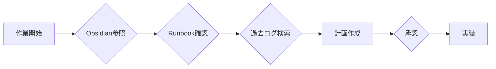

# MEKIKI 自律運用メソドロジー

> **Anti-Regression Mandate v1.1**: 全ての実装は体系的調査プロセスに従う

## 1. 環境構築プロトコル

### 1.1 作業開始前の必須チェック



| ステップ | 確認対象 | 場所 |
|----------|----------|------|
| 1 | 関連する過去会話 | `50_Logs/conversations/` |
| 2 | 意思決定履歴 | `50_Logs/decisions/` |
| 3 | Runbook | `00_Runbook/` |
| 4 | プロジェクト設計 | `10_Projects/` |

### 1.2 連携システム

| システム | 役割 | 状態確認コマンド |
|----------|------|------------------|
| Obsidian | 正本・知識ベース | ファイル存在確認 |
| Antigravity | AI実行環境 | セッション活性 |
| Clawdbot | Slack通知 | `wsl clawdbot channels list` |
| ClaudeCode | コード実行 | `.claude/` 確認 |

---

## 2. 問題解決プロトコル

### 2.1 必須参照

1. **Obsidian Vault**
   - `00_Runbook/mekiki_operations.md`
   - `10_Projects/{関連プロジェクト}/`

2. **Runbook追加要綱**
   - `RUNBOOK_ADDITION_v1.md` Section 8 (回帰調査プロセス)

3. **過去ログ**
   - Antigravity Brain の conversation logs
   - Knowledge Items

### 2.2 4フェーズ調査

| Phase | 内容 | 成果物 |
|-------|------|--------|
| Discovery | 差分特定 | 差分一覧 |
| Analysis | 影響評価 | 影響マトリクス |
| Solution Design | 最適解設計 | オプション比較表 |
| Implementation | 段階的実装 | コミット履歴 |

---

## 3. 自律性担保メソッド

### 3.1 計画→承認→実装サイクル

```
[問題発見] → [調査] → [計画書作成] → [ユーザー承認] → [実装] → [検証]
```

> [!IMPORTANT]
> **どんぶり実装禁止**: すべての変更は計画書承認後に実施

### 3.2 質問ポリシー

以下の場合は**必ず質問**する:

- [ ] 定義の分岐がある場合
- [ ] 複数の合理的な選択肢がある場合
- [ ] ボトルネックが予想される場合
- [ ] 過去の決定と矛盾する可能性がある場合

### 3.3 効率最大化

| 観点 | 方法 |
|------|------|
| 重複排除 | 過去ログ・KI検索 |
| 再利用 | SDK活用 |
| 通知 | Clawdbot自動化 |
| 記録 | Obsidian自動エクスポート |

---

## 4. 連携機能運用

### 4.1 Clawdbot

```python
from app.sdk.notification.clawdbot_client import get_clawdbot_client

client = get_clawdbot_client()
client.send_message("#mekiki-ops", "✅ タスク完了")
```

### 4.2 Antigravity Skills

```
.agent/skills/
└── mekiki_ops/
    ├── SKILL.md         # メイン指示書
    └── scripts/         # 自動化スクリプト
```

### 4.3 Obsidian RAG

- **読み取り**: `view_file` で Vault *.md 参照
- **書き込み**: `write_to_file` でログ/決定記録

---

## 5. 検証チェックリスト

実装前に確認:

- [ ] Obsidian関連ドキュメント参照済み
- [ ] 過去の類似タスク検索済み
- [ ] Runbook該当セクション確認済み
- [ ] 計画書作成・承認済み
- [ ] 質問事項整理済み

---

Tags: #Methodology #Autonomous #Integration #MEKIKI #v1.0.0
