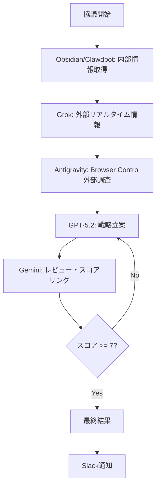
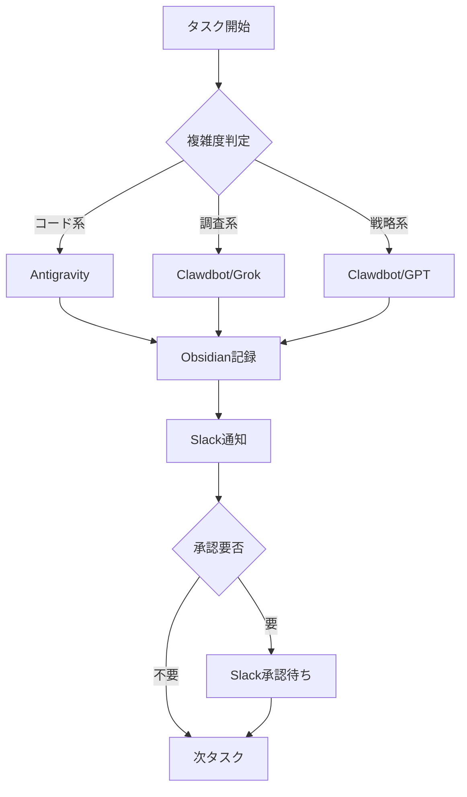

# MEKIKI Orchestra System 仕様書

> **Version**: 1.0.0  
> **Created**: 2026-01-31  
> **Status**: Active

---

## 概要

MEKIKI Orchestra Systemは、複数のAIエージェントを調和的に連携させる自律運用フレームワーク。

```
              ┌─────────────────────────────────────┐
              │        MEKIKI Orchestra System       │
              └─────────────────────────────────────┘
                              │
      ┌───────────────────────┼───────────────────────┐
      │                       │                       │
┌─────┴─────┐           ┌─────┴─────┐           ┌─────┴─────┐
│Antigravity│◄─────────►│  Clawdbot │◄─────────►│   Slack   │
│  (Claude) │  Skills   │ (WSL/GPT) │  Webhook  │ (双方向)  │
└───────────┘           └───────────┘           └───────────┘
```

---

## エージェント役割分担（必須協議メンバー）

> **重要**: 全協議において以下の5エージェントからの**精確なフィードバック**を必須とする

| エージェント | 役割 | 情報ソース | 担当タスク |
|-------------|------|-----------|-----------|
| **GPT-5.2 (Clawdbot)** | 戦略立案 | 内部 | 戦略相談、プラン承認、セカンドオピニオン |
| **Grok (Clawdbot)** | リアルタイム検索 | 外部 | Web調査、最新情報収集、X検索 |
| **Antigravity (Claude)** | IDE統合・外部情報 | 外部 | コーディング、Browser Control、ファイル操作 |
| **Clawdbot** | 内部知識 | 内部 | Obsidian連携、ログ検索、設定管理 |
| **Gemini (Reviewer)** | レビュー・評価 | 内部 | Producer-Reviewerパターン、スコアリング |

### 協議時の必須フロー



### 補助エージェント

| エージェント | 役割 |
|-------------|------|
| **Slack** | 通知、遠隔操作、承認 |
| **Obsidian** | ナレッジ管理、正本管理 |

---

## コンポーネント

### 1. orchestra.py

**パス**: `app/sdk/orchestra.py`

マルチエージェント議論を実行：

```python
from app.sdk.orchestra import discuss
result = discuss("トピック")
```

### 2. slack_bidirectional.py

**パス**: `app/sdk/notification/slack_bidirectional.py`

双方向Slack連携：

```python
from app.sdk.notification.slack_bidirectional import (
    broadcast_status,    # ステータス配信
    broadcast_progress,  # 進捗配信
    broadcast_research   # 調査結果配信
)
```

**Slackコマンド**:

- `/mekiki status` - 現在のタスク状態
- `/mekiki help` - コマンド一覧
- `/mekiki go` - 次のタスク開始
- `/mekiki stop` - タスク停止
- `/mekiki research <query>` - Web検索

### 3. ab_test_framework.py

**パス**: `app/sdk/ab_test_framework.py`

Antigravity vs Clawdbot 比較テスト

---

## ワークフロー

### 自律運用フロー



### Producer-Reviewer パターン

1. **GPT (Producer)**: 戦略・提案を生成
2. **Gemini (Reviewer)**: レビュー＆スコアリング
3. スコア < 7 → GPTが改善版生成
4. 最終版をObsidianに保存

---

## 自律活用ガイドライン

### 自動実行（承認不要）

- Obsidian読み取り・ログ書き込み
- Slack通知
- Web検索（Grok）
- 静的解析（py_compile）

### 承認必須

- コード変更
- 設計変更
- canonical登録
- 機能の有効化/無効化

---

## 参照

- [[project_sanctuary]] - 聖域定義書
- [[autonomous_behavior_framework]] - 自律行動フレームワーク
- [[GPT52_Session_Bridge]] - GPT-5.2連携

---

Tags: #Architecture #Orchestra #MEKIKI #Autonomous
