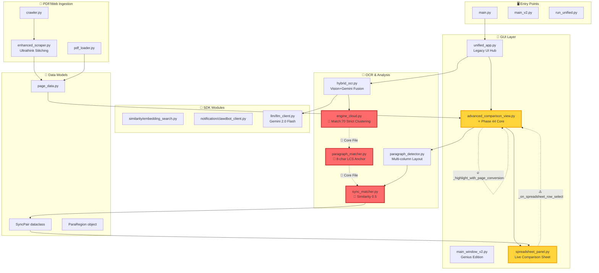
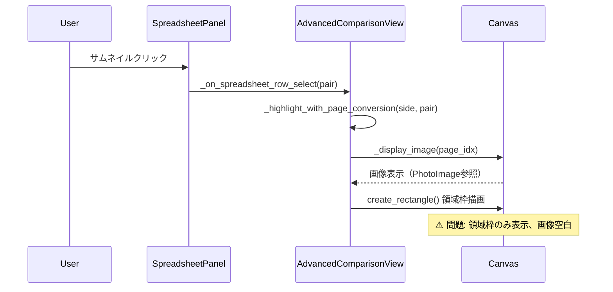

# MEKIKI Architecture v12.4.6 - 依存関係図

**最終更新**: 2026-01-30
**目的**: 全モジュールの依存関係を可視化し、Phase 44クラスの複雑問題の調査起点とする

---

## システム全体構成

---

## 🔴 Core Files Protection Policy

**以下のファイルは Match:70 検証なしに変更禁止**:

| ファイル | 責務 | 最終安定版 |
|----------|------|-----------|
| `engine_cloud.py` | OCR Clustering (Overlap 0.6, Gap 2.5x) | Match:70 Baseline |
| `sync_matcher.py` | Similarity 0.5, Min 8-char LCS | Match:70 Baseline |
| `paragraph_matcher.py` | 8-char Anchor Matching | Match:70 Baseline |

**変更時の必須手順**:

1. タイムスタンプ付きバックアップ作成
2. 変更後即座にOCRテスト実行
3. Match数が低下した場合は即座にロールバック

---

## 🔥 Phase 44: Canvas画像表示問題

### 問題経路

### 推定原因

1. **PhotoImage GC問題**: `self._current_image` 参照が保持されていない
2. **Z-order不一致**: 画像が領域枠の下層に隠れている
3. **座標変換エラー**: `transform.src_rect_to_view()` が画面外座標を返している

---

## 🧩 モジュール責務マトリクス

| レイヤー | モジュール | 入力 | 出力 | 依存先 |
|----------|-----------|------|------|--------|
| **Entry** | `unified_app.py` | ユーザー操作 | GUI状態遷移 | `advanced_comparison_view.py` |
| **View** | `advanced_comparison_view.py` | PageData, SyncPair | Canvas描画 | `spreadsheet_panel.py`, `hybrid_ocr.py` |
| **Sheet** | `spreadsheet_panel.py` | SyncPair[] | 行セル | Callback to View |
| **OCR** | `hybrid_ocr.py` | PIL.Image | DetectedArea[] | `engine_cloud.py`, `llm_client.py` |
| **Cluster** | `engine_cloud.py` | DetectedArea[] | Paragraph[] | - |
| **Match** | `sync_matcher.py` | Paragraph[], Paragraph[] | SyncPair[] | - |
| **SDK** | `llm_client.py` | Prompt, Image | JSON Response | Gemini API |

---

## 📦 バックアップ戦略

### Tier 1: Gold Standard

- `OCR_MEKIKI_v1_Final_20260117` - Legacy UI完全版
- `OCR_backup_20260128_224817` - Phase 44直前の安全版

### Tier 2: Feature Baseline

- `OCR_GoogleVisionAPI_AImode_Backup_20260114` - AI Analysis Mode基準

### Tier 3: Emergency Restore

最新の動作確認済みバックアップ（`backup_catalog.md`参照）

---

## 🔍 調査起点

**Phase 44クラスの問題発生時**:

1. この `architecture.md` で**データフロー**を確認
2. **🔥マーク箇所**のログを優先調査
3. **🔴Core Files**は最終手段（バックアップ必須）

**ファイル特定後**:

1. `Vault/50_Logs/incidents/` で類似事例検索
2. `backup_catalog.md` で関連モジュールの安定版特定
3. 4フェーズ調査プロセス適用

---

## 参照

- [MEKIKI Operations Skill](../.agent/skills/mekiki_ops/SKILL.md)
- [Autonomous Behavior Framework](./Vault/00_Runbook/autonomous_behavior_framework.md)
- [Backup Catalog](./Vault/10_Projects/mekiki/backup_catalog.md)
