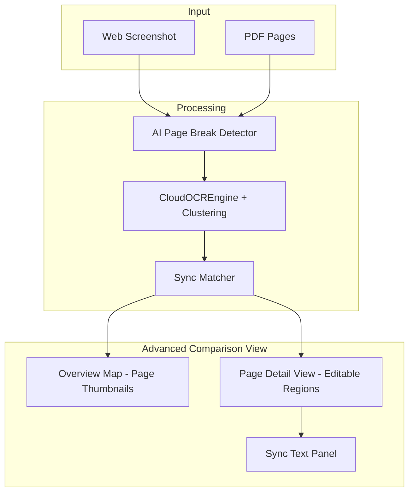

# Advanced Proofing Workspace Implementation Plan

## Goal
Transform the embedded 「⚖️ 比較マトリクス」 frame into a professional proofing workspace with:
- **AI-based page break detection** for logical A4 page splitting
- **Dynamic Clustering OCR** using Google Vision API for paragraph detection
- **Editable regions** with drag-resize and split/merge
- **Sync numbering** (Page-Seq-Sync) for cross-document matching
- **Real-time text synchronization**

---

## Architecture



---

## Proposed Changes

### 1. Core Engine: `app/core/page_detector.py` [NEW]

AI-based page break detection using whitespace analysis and content flow.

```python
class PageBreakDetector:
    """AI-based page break detection for long screenshots/PDFs"""
    
    def detect_breaks(self, image: Image, clusters: List[Dict]) -> List[int]:
        """
        Detect logical page breaks based on:
        - Large vertical gaps between clusters
        - Horizontal rule patterns
        - Content density changes
        
        Returns: List of y-coordinates for page breaks
        """
```

---

### 2. Core Engine: `app/core/sync_matcher.py` [NEW]

Paragraph similarity matching with sync number generation.

```python
class SyncMatcher:
    """Match paragraphs between Web and PDF sources"""
    
    def match_paragraphs(
        self, 
        web_clusters: List[Dict], 
        pdf_clusters: List[Dict]
    ) -> List[SyncPair]:
        """
        Use fuzzy string matching to pair similar paragraphs.
        Assigns sync numbers to matched pairs.
        
        Returns: List of SyncPair(web_id, pdf_id, sync_no, similarity)
        """
```

---

### 3. UI: `app/gui/windows/advanced_comparison_view.py` [NEW]

New dual-pane proofing workspace replacing the embedded frame.

#### Layout Design

```
┌─────────────────────────────────────────────────────────────────┐
│ ⚖️ Advanced Proofing Workspace                    [🔄][📤]     │
├─────────────────────────────────────────────────────────────────┤
│ ┌─── Overview Map ──┐  ┌─── Page Detail ─────────────────────┐ │
│ │ ┌──┐ ┌──┐ ┌──┐   │  │ Web Source          PDF Source      │ │
│ │ │P1│ │P2│ │P3│   │  │ ┌───────────────┐  ┌──────────────┐ │ │
│ │ └──┘ └──┘ └──┘   │  │ │ [P1-1 S1]     │  │ [P1-1 S1]    │ │ │
│ │ (thumbnails)     │  │ │ テキスト...    │  │ テキスト...   │ │ │
│ └──────────────────┘  │ ├───────────────┤  ├──────────────┤ │ │
│                       │ │ [P1-2 S2]     │  │ [P1-2 S2]    │ │ │
│ ┌─── Area List ────┐  │ │ 次のテキスト...│  │ 次の...      │ │ │
│ │ P1-1 S1 ✅ 98%   │  │ └───────────────┘  └──────────────┘ │ │
│ │ P1-2 S2 ✅ 95%   │  └─────────────────────────────────────┘ │
│ │ P1-3 S3 ⚠️ 72%   │                                          │
│ │ P2-1 -- ❌ NEW   │  ┌─── Sync Text Panel ─────────────────┐ │
│ └──────────────────┘  │ Web: おトクなきっぷで九州の...      │ │
│                       │ PDF: おトクなきっぷで九州の...      │ │
│                       │ Diff: [No changes]                   │ │
│                       └─────────────────────────────────────┘ │
├─────────────────────────────────────────────────────────────────┤
│ Status: P1-1 selected | Sync Rate: 98% | 12 areas detected     │
└─────────────────────────────────────────────────────────────────┘
```

#### Key Features

1. **Overview Map**: Thumbnail strip of detected pages (clickable)
2. **Page Detail View**: Side-by-side Web/PDF with editable regions
3. **Area List**: All detected areas with Page-Seq-Sync codes and match %
4. **Sync Text Panel**: Selected area's text comparison with diff

---

### 4. Region Editing System

#### Interactive Handles
- **Corner handles**: Resize region
- **Edge handles**: Adjust single edge
- **Center drag**: Move entire region
- **Double-click**: Split region horizontally
- **Shift+click two regions**: Merge regions

#### Real-time Update Flow
```
User drags handle → Update region rect → 
  → Recalculate text from raw_words in region →
  → Update sync matching →
  → Refresh text panel
```

---

### 5. Numbering System

| Component | Format | Example | Description |
|-----------|--------|---------|-------------|
| Page | `P{n}` | `P1` | Detected page number |
| Sequence | `-{n}` | `P1-3` | Area sequence within page |
| Sync | `S{n}` | `P1-3 S5` | Matched pair ID (same across Web/PDF) |

**Unmatched areas**: Display `--` instead of sync number with ❌ or ➕ icon.

---

### 6. Integration Points

#### [MODIFY] [comparison_matrix.py](file:///c:/Users/raiko/OneDrive/Desktop/26/OCR/app/gui/windows/comparison_matrix.py)

Replace `ComparisonMatrixFrame._build_ui()` content to launch `AdvancedComparisonView`.

#### [MODIFY] [unified_app.py](file:///c:/Users/raiko/OneDrive/Desktop/26/OCR/app/gui/unified_app.py)

Ensure `comparison_queue` data flows to new view with screenshots.

---

## Verification Plan

### Automated Tests
1. Unit test `PageBreakDetector` with synthetic images
2. Unit test `SyncMatcher` with known paragraph pairs
3. Integration test OCR → Clustering → Sync flow

### Manual Verification
1. Crawl a test site, load PDF
2. Verify page thumbnails appear in Overview Map
3. Click page → verify regions with P-Seq-Sync codes
4. Drag region edge → verify text updates in real-time
5. Compare matched areas → verify sync highlighting
